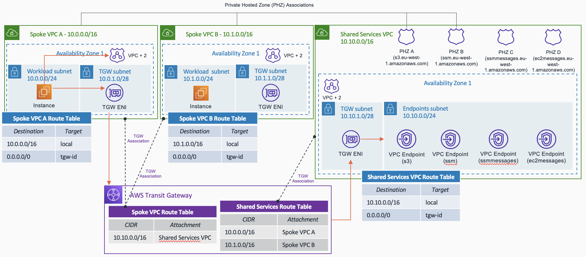

---

---

# Example: AWS Hub and Spoke with centralized Endpoints VPC - Logging disabled

This example uses the AWS Hub and Spoke module to create a central endpoints VPC. The resources created by the module are the following ones:

- AWS Transit Gateway, TGW attachments to the Endpoints VPC and Spoke VPCs, and its corresponding TGW Route Tables.
- Endpoints VPC, with centralized VPC endpoints necessary to have AWS Sytems Manager access (ssm, ssmmessages, ec2messages)
- Two Spoke VPCs
- Logging disabled.

The module does not create any EC2 instances, or IAM role - leaving the user the freedom to configure all these resources. For you to have an example on how these resources can be created, you will see code that deploys:

- EC2 instances in the Spoke VPC, and IAM role and Security Group to allow SSM and S3 access.
- Interface VPC endpoint for Amazon S3 access, and a Private Hosted Zone associated to the Spoke VPCs to allow DNS resolution of queries to S3.

## Prerequisites

- An AWS account with an IAM user with the appropriate permissions
- Terraform installed

## Code Principles:

- Writing DRY (Do No Repeat Yourself) code using a modular design pattern

## Usage

- Clone the repository
- Edit the variables.tf file in the project root directory. This file contains the variables that are used to configure the VPCs to create, and Hybrid DNS configuration needed to work with your environment.
- To change the configuration about the Security Groups and VPC endpoints to create, edit the locals.tf file in the project root directory
- Initialize Terraform using `terraform init`
- Deploy the template using `terraform apply`

**Note** The default number of Availability Zones to use in the Spoke VPCs is 1. To follow best practices, each resource will be created in each Availability Zone. **Keep this in mind** to avoid extra costs unless you are happy to deploy more resources and accept additional costs.

<!-- BEGIN_TF_DOCS -->
## Requirements

| Name | Version |
|------|---------|
|  [terraform](#requirement\_terraform) | 1.1.4 |
|  [aws](#requirement\_aws) | 3.73.0 |

## Providers

| Name | Version |
|------|---------|
|  [aws](#provider\_aws) | 3.73.0 |

## Modules

| Name | Source | Version |
|------|--------|---------|
|  [central\_endpoints](#module\_central\_endpoints) | ../.. | n/a |
|  [compute](#module\_compute) | ./modules/compute | n/a |
|  [iam](#module\_iam) | ./modules/iam | n/a |

## Inputs

| Name | Description | Type | Default | Required |
|------|-------------|------|---------|:--------:|
|  [aws\_region](#input\_aws\_region) | AWS Region to create the environment. | `string` | `"eu-west-1"` | yes |
|  [cidr\_blocks](#input\_cidr\_blocks) | CIDR blocks to use in the different VPCs to create | `any` | <pre>{   "endpoints_vpc": "10.10.0.0/16",   "spoke_vpcs": {     "spoke_1": "10.0.0.0/16",     "spoke_2": "10.1.0.0/16"   } }</pre> | yes |
|  [identifier](#input\_identifier) | Project identifier | `string` | `"hub-spoke-endpoints"` | yes |
|  [instance\_type](#input\_instance\_type) | Instance type to use in the EC2 instances. | `string` | `"t2.micro"` | yes |
|  [number\_azs](#input\_number\_azs) | Number of AZs - to indicate in all the VPCs created | `number` | `2` | yes |

## Outputs

| Name | Description |
|------|-------------|
|  [ec2\_instances](#output\_ec2\_instances) | EC2 instances created. |
|  [endpoints\_vpc](#output\_endpoints\_vpc) | VPC ID of the Inspection VPC. |
|  [extra\_vpc\_endpoint](#output\_extra\_vpc\_endpoint) | S3 VPC Endpoint. |
|  [spoke\_vpcs](#output\_spoke\_vpcs) | VPC IDs of the Spoke VPCs. |
|  [transit\_gateway](#output\_transit\_gateway) | AWS Transit Gateway ID. |
|  [vpc\_endpoints](#output\_vpc\_endpoints) | Interface VPC endpoints created. |
<!-- END_TF_DOCS -->